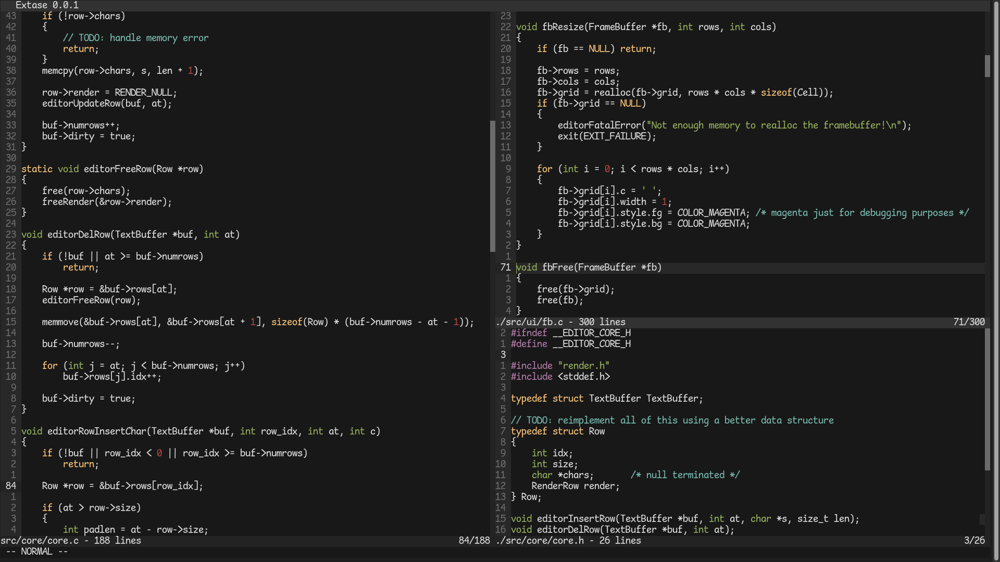

**Extase** is a modern, lightweight terminal-based text editor engineered from the ground up in pure C. It is built with a zero-dependency philosophy, avoiding libraries like ncurses in favor of the raw POSIX terminal API. 

Extase is currently compatible with all modern POSIX systems, with native Windows support on the roadmap.

## Installation
Because Extase relies purely on the POSIX standard with no external dependencies, building it is fast and straightforward. You only need a C compiler (GCC or Clang) and Make tool.

#### Build from source
First, download the repository from github
```
git clone https://github.com/alechiozza/extase.git
```

Then, compile it with
```
cd extase
make
```
**(Optional)** You can install extase globally on your system with
```
sudo make install
```
Or uninstall it with
```
sudo make uninstall
```

To run the editor, you just need to type
```
extase <filename>
```

## Screenshots



## Contributing

Contributions are welcome and appreciated! Please use the [Issue Tracker](https://github.com/alechiozza/extase/issues) to report bugs, suggest new features, or ask questions about the codebase.

We are open to Pull Requests from the community. If you are interested in fixing a bug or implementing a feature, feel free to submit a PR :)
